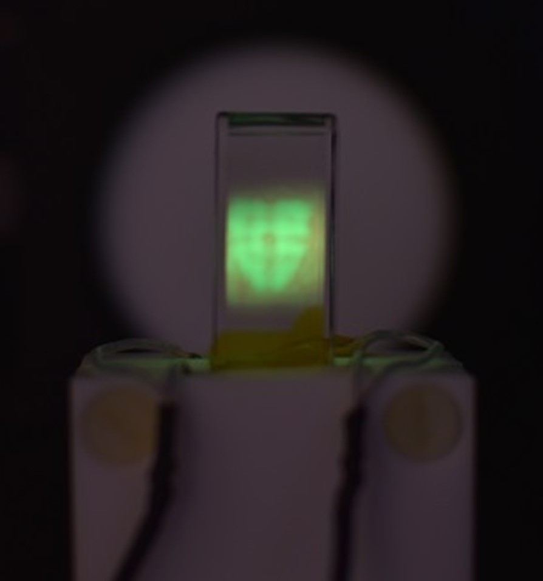
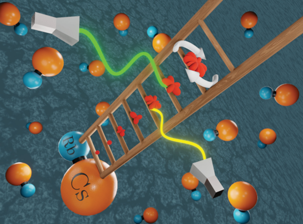
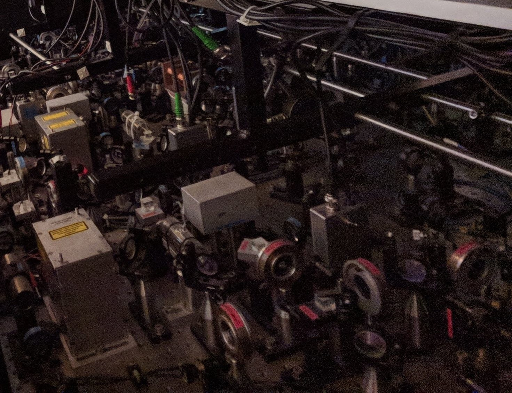
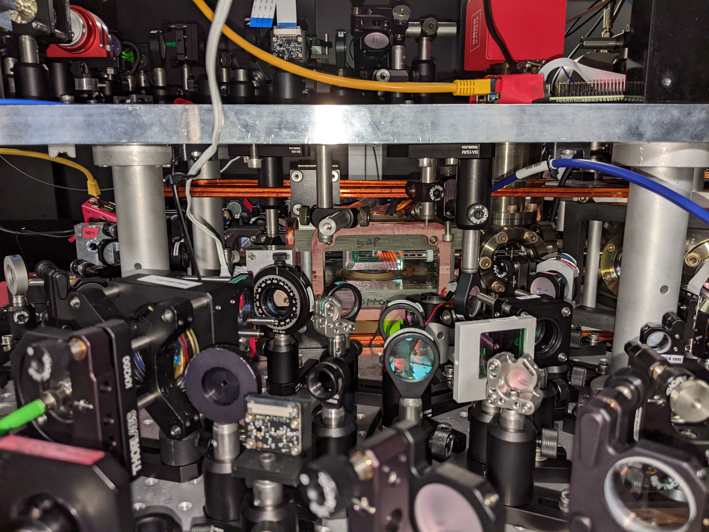
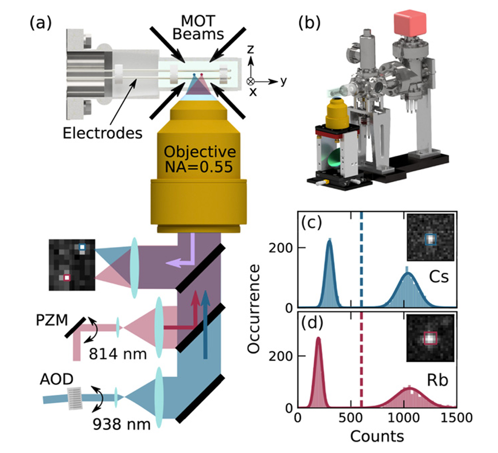
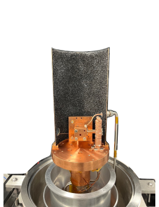
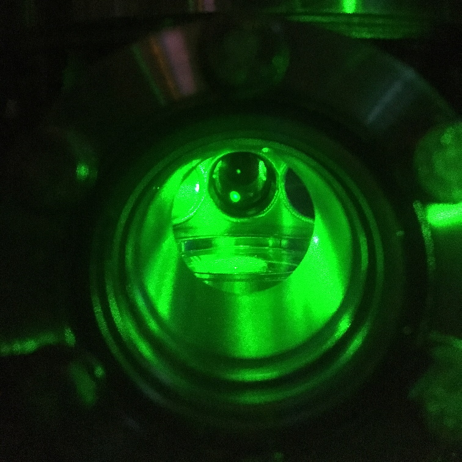

 _Current PhD students in the QLM_ 
  {{ site.url }}{{ site.baseurl }}
When you join Durham Quantum Light and Matter (QLM) as a PhD or Master by research student, you’ll become a member of a friendly research section home to almost 50 members, 
including permanent staff, research fellows, research associates and PhD students.  

Each graduate cohort receives training in skills required to excel in the program. This includes lecture courses in atom-light interactions and advanced data analysis, 
and experimental skills workshops on CAD design and optics. Students and postdoctoral researchers are all given a desk in the shared office enabling easy sharing of ideas and problem solving.  

Each week begins with our group meeting, when each team member is given the opportunity to share updates from their project. During term time we host weekly seminars from 
external speakers. These is also the opportunity to travel and attend international conferences and meet researchers from around the world. These are just some of the 
opportunities and benefits available to members of the group.  

We have a selection of funded PhD projects available, and further opportunities which are likely to receive funding for an October 2024 start. In addition we support the application to <a href="https://www.durham.ac.uk/study/scholarships/postgraduate/">scholarships</a>. futher information regarding the application process can be found <a href="https://www.durham.ac.uk/study/postgraduate/research-degrees/how-to-apply/">here</a>. 

We hope that you will join us and become a part of the QLM! 

## Funded Projects
<table border=0>
  <tr>
    <td>
      	<b>High Speed Terahertz Imaging using Rydberg Atoms.</b> 
The terahertz (THz) frequency band lies between the infrared and microwave regions of the electromagnetic spectrum. Because THz radiation is non-ionising and passes through materials such as paper, cloth, and   plastics, it finds applications including security screening, biomedical imaging, and production-line monitoring. The THz region has traditionally been a difficult frequency range to work in because it falls between ranges of electronic and photonic devices - This is known as the ‘terahertz gap’ and although significant progress has been made to close this gap, applications are still limited by the low power output of THz sources and the low speed and sensitivity of THz detectors. In Durham, we have recently developed a new technology for terahertz imaging that uses Rydberg atoms to convert terahertz radiation to optical fluorescence. This has allowed unprecedented speed and sensitivity in image acquisition. This experimental Ph.D. project will push our technology to the next level by using laser pulse sequences to allow very short exposure images. This will allow very fast phenomena, such as shockwaves, to be studied in optically opaque media. The work is linked to the National Quantum Technology Hub programme and Industrial partners. 
<a href="https://durham-qlm.uk/research/tech/terahertz/">Further information available here</a> or contact <a href="mailto:k.j.weatherill@durham.ac.uk">Prof. Weatherill</a>.
      <td width=300 align=center></td>
</td>
  </tr>

  <tr>
    <td>
      	<b>Simulating quantum magnetism and synthetic dimensions using ultracold molecules in magic traps.</b> 
The rich rotational structure of molecules offers an unrivalled playground for the encoding of spins and synthetic dimensions which can be precisely controlled using microwave fields. We have recently demonstrated record-breaking rotational coherences in a novel magic-wavelength trap. In this project you will exploit this capability to study models of quantum magnetism with spins encoded in the rotational states of RbCs molecules and interactions controlled through the combination of states and applied fields. 
<a href="https://www.cornishlabs.uk/rbcs">Further information available here</a> or contact <a href="mailto:s.l.cornish@durham.ac.uk">Prof. Cornish</a>.
      <td width=300 align=center></td>
</td>
  </tr>

  
  <tr>
    <td>
            <b>Dipolar quantum gas of atoms</b> 
            Ultracold gases of atoms and molecules are an important resource for the precise experimental study of quantum mechanics. In these experiments, dipole-dipole interactions can be used to engineer long-range and tunable interactions between particles, thereby enabling the study of complex many-body phenomena. In this project, we will develop a new apparatus for the study of dipolar quantum gases. This will include an exploration of laser cooling and optical trapping of atoms, and the study of collisions and interactions in atomic mixtures. 
            This is a new experimental project, for further information contact <a href="mailto:p.d.gregory@durham.ac.uk">Dr. Gregory</a>.
  </td>
         <td width=300 align=center></td>
    </tr>

  <tr>
    <td>
      	<b>Many-body physics of polar molecules in a quantum gas microscope.</b> 
Quantum gas microscopes have revolutionized the study of ultracold atomic gases in optical lattice, enabling the detection of individual atoms with single site resolution. In this project you will develop and apply the technique to ultracold RbCs molecules, using it to study strongly correlated phases of molecules in the presence of long-range dipole-dipole interactions. 
<a href="https://www.cornishlabs.uk/microscope">Further information available here</a> or contact <a href="mailto:s.l.cornish@durham.ac.uk">Prof. Cornish</a>.
      <td width=300 align=center></td>
</td>
  </tr>

<tr>
  <td>
      	<b>Quantum computation using ultracold molecules and Rydberg atoms in optical tweezers.</b> 
	We have pioneered a new approach to forming ultracold RbCs molecules. We take single atoms of Rb and Cs confined in separate optical tweezers, cool them to motional ground state of their respective traps and then carefully combine them to form a molecule in the rovibrational ground state. In this project you will investigate how to combine the molecules with Rydberg atoms in order to perform non-destructive readout of the molecular state and to engineer quantum entanglement between pairs of molecules. 
<a href="https://www.cornishlabs.uk/tweezers">Further information available here</a> or contact <a href="mailto:s.l.cornish@durham.ac.uk">Prof. Cornish</a>.
      <td width=300 align=center></td>
</td>
  </tr>
</table>

## Further Opportunities

<table>
<tr>
    <td>
      	<b>Quantum Networks with Rydberg excitons</b> 
	Quantum computers made by Google, IBM and others are based on microwave superconducting circuits that must be cooled to milliKelvin temperatures to avoid decoherence. This makes it hard to directly network these computers together. A promising alternative is to up-covert the quantum information to the optical region, and send it down conventional optical fibres. The goal of this project is to help develop such a quantum up-converter using a beautiful piece of physics at the crossover between atomic and condensed matter physics. In a semiconductor called cuprous oxide, electrons and holes bind together to form quasi-particles called excitons, which have internal states just like atoms. In collaboration with Cardiff University we have pioneered  microwave-optical coupling in cuprous oxide, and we are now looking to exploring the quantum limits of what can be achieved with this technology. 
<a href="https://durham-qlm.uk/research/rydberg/excitons/">Further information available here</a> or contact <a href="mailto:m.p.a.jones@durham.ac.uk">Prof. Jones</a>.
      <td width=300 align=center></td>
</td>
  </tr>
  
<tr>
  <td>
	<b>Vector Light project</b> 
	The Durham Quantum Light and Matter group is internationally leading on experiments in the field of spectroscopy of atomic vapours.   Most treatments of the propagation of light through a medium assume that the     polarisation vector is two dimensional, i.e. restricted to the transverse plane. Recent study has shown that far more interesting and useful three-dimensional structures can be obtained by tightly focussing a       laser beam. We have shown in Durham that using shaped light enables the production of topologically non-trivial polarization.  
  The objective of this project is to analyse the spectrum of Rb vapour in large magnetic fields (we have our own 1.5 Tesla permanent magnet with different polarization states. The goals of the project are: (i) a     complete characterization of the spectroscopy of Rb vapour in large magnetic fields with tightly focussed fields; (ii) to investigate the interaction of atoms with topological light; (iii) explore the     possibilities of producing next generation sensors based on the interaction of structured light with atomic media. 
<a href="https://durham-qlm.uk/research/vapours/magnets/">Further information available here</a> or contact <a href="mailto:i.g.hughes@durham.ac.uk">Prof. Hughes</a>.
      <td width=300 align=center></td>
</td>
</tr>

  <tr>
	<td>
 <b>Laser cooling molecules for quantum simulation</b> 
Laser-cooled molecules offer new opportunities in quantum science and technology. By using closed cycling transitions we are able to decelerate, trap, cool and detect molecules. The goal of this experiment is to load a lattice of ultracold calcium monofluoride molecules to be used as a platform for quantum simulation. These molecules experience large, anisotropic dipole-dipole interactions, and high levels of control over internal and external degrees of freedom have already been demonstrated. This is an experimental project during which you will learn skills in laser and vacuum technology, build an understanding of molecular physics and contribute to the rapidly expanding field of molecular quantum technology. 
<a href="https://durham-qlm.uk/research/coldmol/cafcool/">Further information available here</a> or contact <a href="mailto:hannah.williams4@durham.ac.uk">Dr. Williams</a>.
<td width=300 align=center></td>	  
 </td>
  </tr>
<tr>
<td>
<b>Quantum degenerate mixtures of Cs and Yb: quantum droplets and polar molecules</b>  
We have the only experiment in the world studying ultracold atomic mixtures of Cs and Yb. This combination of elements is exceptionally rich and offers unique opportunities for independently controlling the individual gases. In this project you will exploit these properties to study the quantum dynamics of dual-species Bose-Einstein condensates and to investigate new ways to assemble the atoms into heteronuclear molecules. 
<a href="https://www.cornishlabs.uk/csyb">Further information available here</a> or contact <a href="mailto:s.l.cornish@durham.ac.uk">Prof. Cornish</a>.
      <td width=300 align=center></td>
	
</td>
</tr>

  
</table>
