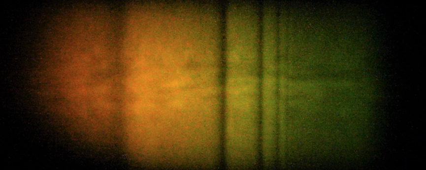

## Excitons
Excitons are atom-like particles which are found in bulk semiconductors. They are formed of an electron and a hole which are bound together by a Coulomb potential. As they are a bound state of a positive and negative charge, they are analogous to hydrogen atoms, and share a similar ladder of energy levels. An exciton spectrum can be seen in the image below, where each dark line is a different exciton resonance. The similarities with an atomic system is immediately apparent in this image from looking at the patterns of these spectral lines. Our studies focus on the highly excited states on the right hand side of the image, known as Rydberg excitons.

## Cuprous Oxide

Our experiments are performed on the semiconductor Cu2O, which is the red gemstone below. Rydberg excitons are incredibly sensitive to their environment, and so very pure crystals must be used. Currently, the highest purity crystals are natural gemstones, but one avenue of our research is to explore the growth of high-purity syntehtic material, through collaborations with Cardiff University. 

## Microwave-optical Coupling 

The high lying Rydberg excitons show many exaggerated properties compared to ground state excitons. Crucially, the dipole-moment associated with transitions between Rydberg states scales with the principal quantum number squared, leading to interactions between excitons and as well as other nonlinear effects. In our experiments we use a microwave field to couple neighbouring Rydberg exciton levels, directly exploiting the large dipole moment associated with these transitions. As we create our Rydberg states through optical excitation with a laser, we have a system which can form the basis of a microwave-optical converter. One of our aims is to create a high-bandwidth and high-efficency microwave-optical converter. To acheive this, one of our current projects is looking at creating a hybrid quantum system consisting of cuprous oxide and a superconducting microwave resonator. 

## Apply Now!
If you are interested in joining the team or finding out more, please contact m.p.a.jones@durham.ac.uk.

## Team members 
[Prof. Matthew Jones](https://www.durham.ac.uk/staff/m-p-a-jones/) (Principal Investigator)  
[Prof. Stuart Adams](https://www.durham.ac.uk/staff/c-s-adams/) (Co-Investigator)  
[Dr. Liam Gallagher](https://www.durham.ac.uk/staff/liam-a-gallagher/) (Postdoctoral Reaseach Assistant)  
[Alistair Brewin](https://www.durham.ac.uk/staff/alistair-brewin/) (PhD student)  
[Qin Xi (Horatio) Wong](https://www.durham.ac.uk/staff/qin-x-wong/) (PhD student) 
## Former members 
[Dr. Jonathan Pritchett](https://www.durham.ac.uk/staff/jonathan-pritchett/) (PhD student)  
[Dr. Joshua Rogers](https://figshare.manchester.ac.uk/authors/Joshua_Rogers/12843404) (Postdoctoral Research Assistant)

## Collaborators
### Cardiff University
[Prof. Stephen Lynch](https://profiles.cardiff.ac.uk/staff/lynchsa)  
[Prof. Wolfgang Langbein](https://profiles.cardiff.ac.uk/staff/langbeinww)  
[Prof. Simon Doyle](https://profiles.cardiff.ac.uk/staff/doylesm) 

### University of St Andrews
[Dr Hamid Ohadi](https://www.st-andrews.ac.uk/physics-astronomy/people/ho35/)

## Publications
[[1] Gallagher, L., Rogers, J., Pritchett, J., Mistry, R., Pizzey, D., Adams, C., Jones, M., Grünwald, P., Walther, V., & Hodges, C. (2022). Microwave-optical coupling via Rydberg excitons in cuprous oxide. Physical Review Research.](https://journals.aps.org/prresearch/pdf/10.1103/PhysRevResearch.4.013031)  

[[2] Rogers, J., Gallagher, L., Pizzey, D., Pritchett, J., Adams, C., Jones, M., Hodges, C., Langbein, W., & Lynch, S. (2022). High-resolution nanosecond spectroscopy of even-parity Rydberg excitons in Cu 2 O. Physical Review B.](https://journals.aps.org/prb/pdf/10.1103/PhysRevB.105.115206)  

[[3] Lynch, S., Hodges, C., Mandal, S., Langbein, W., Singh, R., Gallagher, L., Pritchett, J., Pizzey, D., Rogers, J., & Adams, C. (2021). Rydberg excitons in synthetic cuprous oxide Cu 2 O. Physical Review Materials.](https://journals.aps.org/prmaterials/pdf/10.1103/PhysRevMaterials.5.084602)

## PhD Theses
[[1] Gallagher, L. (2022). Optical and microwave spectroscopy of Rydberg excitons in Cu $ _2 $ O. Doctoral dissertation, Durham University.](http://etheses.dur.ac.uk/14296/1/Gallagher000720653_corrected.pdf)
