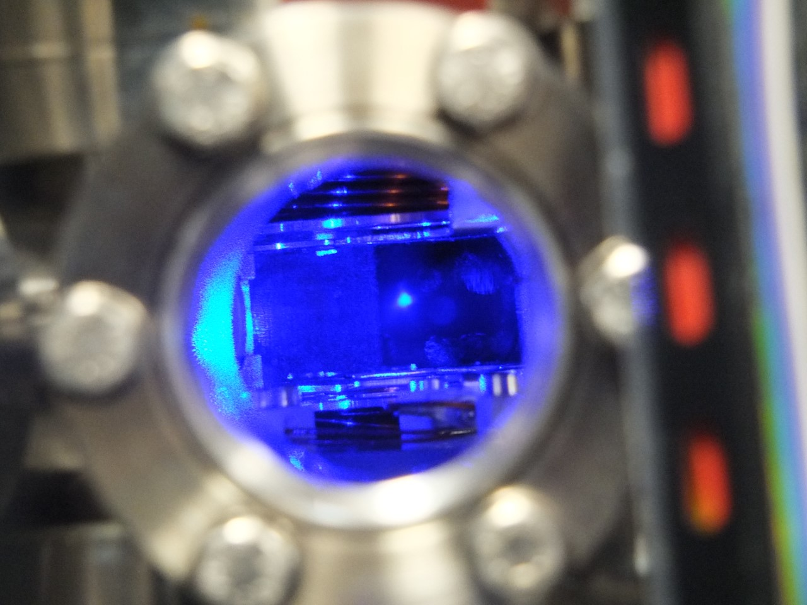
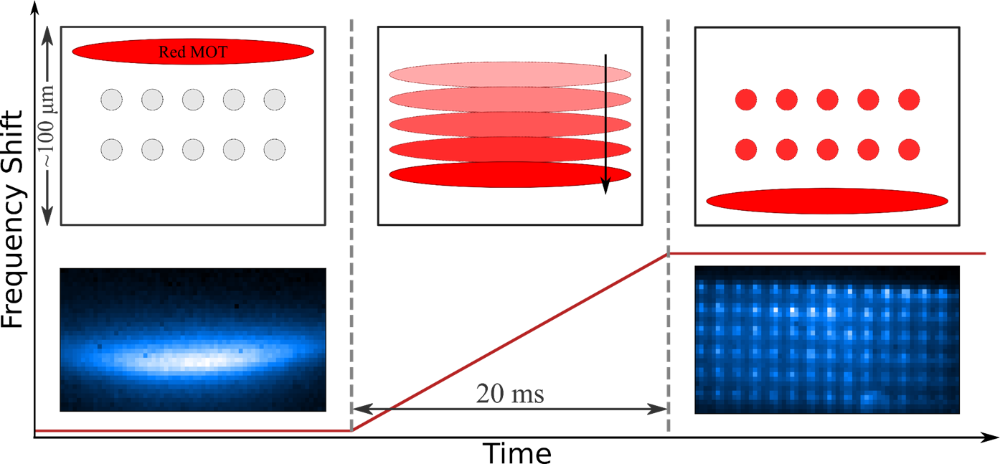
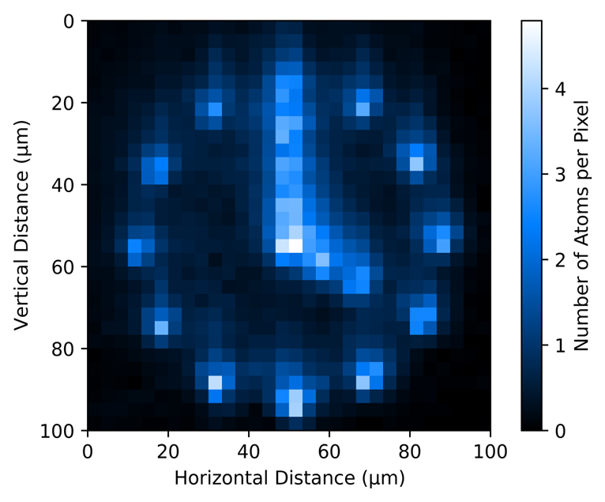
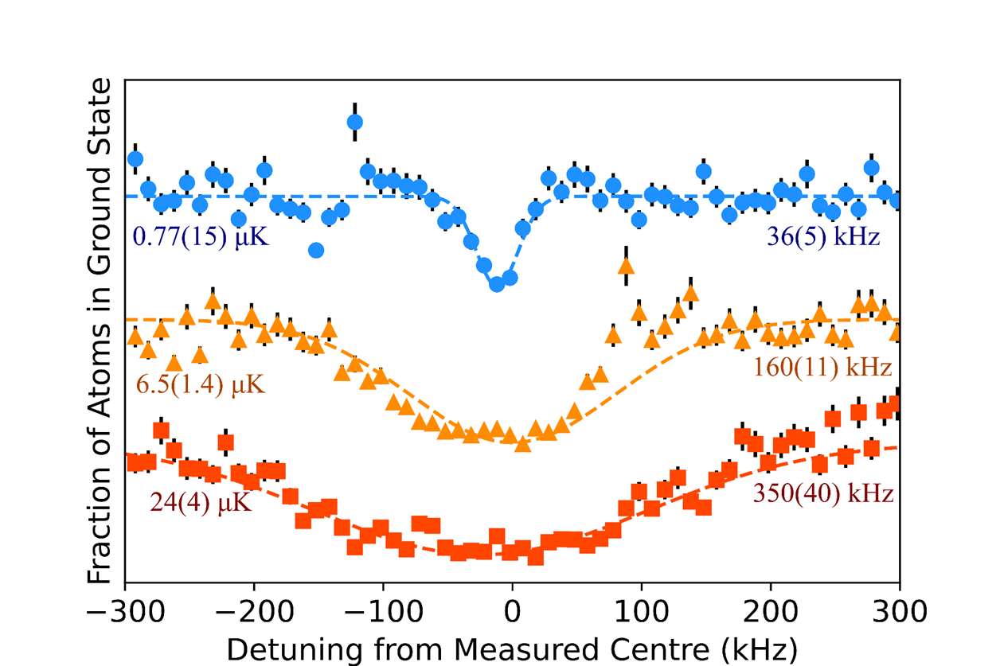
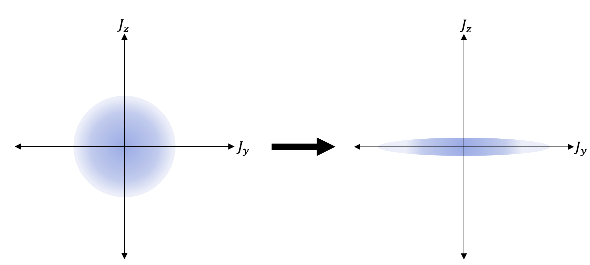

## Introduction To Strontium Atomic Clock
Clocks use a physical phenomenon as a reference to keep track of time. For example, a pendulum clock uses the time it takes for a swinging weight to complete a cycle as a reference to count time. 

In the modern age, the most accurate time-keeping system is the atomic clock: these reference the transition frequency of atoms to keep track of time.

Several different species of atoms can be used to create an atomic clock such as Rubidium and Caesium. However, Strontium atomic clocks are considered to be one of the most precise and have been experimentally demonstrated to have a fractional frequency uncertainty in the order of ~. To put this in perspective, the clock must run longer than the age of the universe for there to be an error of ~1 second in timekeeping!

 

||
|:--:| 
| Fig. 1: the energy-level structure of Strontium. |

 

This is possible due to a fundamental property of the Strontium’s atomic levels. Traditionally, certain atomic transitions are forbidden under the [‘selection’ rules](https://chem.libretexts.org/Bookshelves/Physical_and_Theoretical_Chemistry_Textbook_Maps/Supplemental_Modules_(Physical_and_Theoretical_Chemistry)/Spectroscopy/Fundamentals_of_Spectroscopy/Selection_rules_and_transition_moment_integral). However, these selection rules are broken and weakly allowed due to state mixing between energy levels when considering different [angular momentum coupling regimes](https://chem.libretexts.org/Bookshelves/Physical_and_Theoretical_Chemistry_Textbook_Maps/Book%3A_Quantum_States_of_Atoms_and_Molecules_(Zielinksi_et_al)/08%3A_The_Hydrogen_Atom/8.08%3A_Coupling_of_Angular_Momentum_and_Spectroscopic_Term_Symbols#:~:text=There%20are%20two%20descriptions%20for,R%2DS%20or%20Russell%2DSaunders%20coupling.) and the presence of a magnetic field. This produces very narrow linewidths (the ‘thickness’ of the energy level transition) that require a very precise frequency of light to drive the transition and therefore make an excellent reference for timekeeping.

## What We Do
### Our Research Focus
Our research focuses on using the Strontium atomic clock transitions to study methods to improve the precision of atomic clocks and to perform high-precision measurements and spectroscopy by using the atom’s Rydberg series. 

### Our Experiment
We have a dedicated experiment to achieve our goals. We initially have a heated sample of  atoms at 700K. We proceed to cool them down in the order of microkelvin by using lasers to slow down the atoms to  and then spatially trap them using lasers and magnets. This is known as a Magneto-optical trap (MOT). 

 

||
|:--:| 
| Fig. 2: Our lab's Magneto-optical trap (MOT) holding Sr88 atoms that are glowing in blue. |

 

Once the atoms are in a MOT, we prepare a 2D array of highly programmable optical tweezers. We then proceed with ‘painted loading’: we sweep the MOT through the tweezer array to transfer atoms from the MOT to the individual sites of the optical tweezer.

 

||
|:--:| 
| Fig. 3: demonstration of paint loading of a tweezer array. |

 

||
|:--:| 
| Fig. 4: atoms loaded in a 2D tweezer array configured in the shape of a ‘clock’. |

 

After inserting the atoms into the tweezer sites, we can perform precise measurements through magnetically induced spectroscopy. Here, we shine a 698 nm laser to induce a transition into the  state (see fig. 1) and observe its absorption spectrum. We are one of the very first UK research groups to experimentally observe this transition.

 

||
|:--:| 
| Fig 5: spectroscopy of the clock transition for various atom temperatures. |

## Why Is This Important?
### Making Atomic Clocks More Accurate
A major factor that is limiting the precision of atomic clocks is what is known as quantum projection noise (QPN) and is associated with measurements on an ensemble of independent, uncorrelated atoms. One potential method to improve the precision of atomic clocks beyond this limit is to use a process called spin-squeezing. 

In this process, an ensemble of correlated atoms through quantum entanglement is prepared into a squeezed state. More specifically, they are prepared in a state such that the precision of two correlated observables is governed by Heisenberg’s uncertainty principle. By reducing the uncertainty of one of the observable at the expense of the other (which we neglect), we can go beyond the QPN limit.

 

||
|:--:| 
| Fig. 6: spin squeezed state. Initially, the atoms are in a coherent spin state and then transformed into a spin-squeezed state where uncertainty is much lower in observable than the other. |

 

Our research group is partly responsible for theorising a practical implementation of spin-squeezing in an optical lattice using Rydberg atoms and demonstrating this as a proof-of-concept could open the possibility for future atomic clocks to be more precise than today’s state-of-the-art atomic clocks.

### Applications In Fundamental Physics and Quantum Technologies
Aside from improving the precision of atomic clocks, the system has further potential application in quantum technologies and towards studying fundamental physics. 

For example, in fundamental physics, such a system can perform high-precision frequency measurements that can be used to test general relativity and to search for physics beyond the standard model.

In the area of quantum technologies, such a system could be used as a basis for a quantum computer or satellite navigation.

## Apply Now!
If you are interested in joining the team or finding out more, please contact m.p.a.jones@durham.ac.uk.

## Team members

- [Prof. Matthew Jones](https://www.durham.ac.uk/staff/m-p-a-jones/) (Principal investigator)
- [Prof. Stuart Adams](https://www.durham.ac.uk/staff/c-s-adams/) (Co-investigator)
- [Dr. Liam Gallagher](https://www.durham.ac.uk/staff/liam-a-gallagher/) (Postdoctoral Research Associate)
- [Mitch Walker](https://www.durham.ac.uk/staff/mitchell-j-walker/) (PhD student)
- [Ryuji Moriya](https://www.durham.ac.uk/staff/ryuji-moriya/) (PhD student)  

## Selected publications
1. E. J. Robertson, N. Šibalić, R.M. Potvliege, and M. P. A. Jones, *ARC 3.0: An expanded Python toolbox for atomic physics calculations*, [Computer Physics Communications **261**, 107814 (2021).](https://doi.org/10.1016/j.cpc.2020.107814)
2. N. C. Jackson, R. K. Hanley, M. Hill, F. Leroux, C. S. Adams, and M. P. A. Jones, *Number-resolved imaging of 88Sr atoms in a long working distance optical tweezer*, [SciPost Phys. **8**, 38 (2020).](http://dx.doi.org/10.21468/SciPostPhys.8.3.038)
3. A. D. Bounds, N. C. Jackson, R. K. Hanley, R. Faoro, E. M. Bridge, P. Huillery, and M. P. A. Jones, *Rydberg-Dressed Magneto-optical Trap*, [Phys. Rev. Lett. **120**, 183401 (2018).](http://dx.doi.org/%2010.1103/PhysRevLett.120.183401)
4. L. I. R. Gil, R. Mukherjee, E. M. Bridge, M. P. A. Jones, and T. Pohl, *Spin Squeezing in a Rydberg Lattice Clock*, [Phys. Rev. Lett. **112**, 103601 (2014).](http://dx.doi.org/10.1103/PhysRevLett.112.103601)

## PhD Theses
- [M. Hill](http://etheses.dur.ac.uk/14662/), *Optical tweezer arrays of strontium atoms* (2022)
- [R. K. Hanley](http://etheses.dur.ac.uk/12905/), *Creation of a strontium microtrap: Towards a spin-squeezed atomic clock* (2018).
- [N. C. Jackson](http://etheses.dur.ac.uk/12825/), *Rydberg spectroscopy and dressing in an ultracold strontium gas* (2018).
- [A. D. Bounds](http://etheses.dur.ac.uk/12541/), *A Rydberg-dressed Magneto Optical Trap* (2018).
- [D. P. Sadler](http://etheses.dur.ac.uk/11911/), *Many-body interactions in a dissipative frozen strontium Rydberg gas* (2016).
- [D. Boddy](http://etheses.dur.ac.uk/10740/), *First observations of Rydberg blockade in a frozen gas of divalent atoms* (2014).
- [C. L. J. Vaillant](http://etheses.dur.ac.uk/10594/), *Long-Range Interactions in One- and Two-Electron Rydberg Atoms* (2014).
- [G. Lochead](http://etheses.dur.ac.uk/6329/), *Excited state spatial distributions in a cold strontium gas* (2012).
- [J. Millen](http://etheses.dur.ac.uk/849/), *A cold strontium Rydberg gas* (2011).
