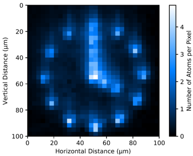

## Overview

## Apply Now!
If you are interested in joining the team or finding out more, please contact m.p.a.jones@durham.ac.uk.

## Team members

- [Prof. Matthew Jones](https://www.durham.ac.uk/staff/m-p-a-jones/) (Principal investigator)
- [Prof. Stuart Adams](https://www.durham.ac.uk/staff/c-s-adams/) (Co-investigator)
- [Dr. Matthew Hill](https://www.durham.ac.uk/staff/matthew-hill2/) (Postdoctoral Research Associate)
- [Dr. Liam Gallagher](https://www.durham.ac.uk/staff/liam-a-gallagher/) (Postdoctoral Research Associate)
- [Mitch Walker](https://www.durham.ac.uk/staff/mitchell-j-walker/) (PhD student)
- Ryuji Moriya (PhD student)  

## Selected publications
1. E. J. Robertson, N. Šibalić, R.M. Potvliege, and M. P. A. Jones, *ARC 3.0: An expanded Python toolbox for atomic physics calculations*, [Computer Physics Communications **261**, 107814 (2021).](https://doi.org/10.1016/j.cpc.2020.107814)
2. N. C. Jackson, R. K. Hanley, M. Hill, F. Leroux, C. S. Adams, and M. P. A. Jones, *Number-resolved imaging of 88Sr atoms in a long working distance optical tweezer*, [SciPost Phys. **8**, 38 (2020).](http://dx.doi.org/10.21468/SciPostPhys.8.3.038)
3. A. D. Bounds, N. C. Jackson, R. K. Hanley, R. Faoro, E. M. Bridge, P. Huillery, and M. P. A. Jones, *Rydberg-Dressed Magneto-optical Trap*, [Phys. Rev. Lett. **120**, 183401 (2018).](http://dx.doi.org/%2010.1103/PhysRevLett.120.183401)
4. L. I. R. Gil, R. Mukherjee, E. M. Bridge, M. P. A. Jones, and T. Pohl, *Spin Squeezing in a Rydberg Lattice Clock*, [Phys. Rev. Lett. **112**, 103601 (2014).](http://dx.doi.org/10.1103/PhysRevLett.112.103601)

## PhD Theses
- [M. Hill](http://etheses.dur.ac.uk/14662/), *Optical tweezer arrays of strontium atoms* (2022)
- [R. K. Hanley](http://etheses.dur.ac.uk/12905/), *Creation of a strontium microtrap: Towards a spin-squeezed atomic clock* (2018).
- [N. C. Jackson](http://etheses.dur.ac.uk/12825/), *Rydberg spectroscopy and dressing in an ultracold strontium gas* (2018).
- [A. D. Bounds](http://etheses.dur.ac.uk/12541/), *A Rydberg-dressed Magneto Optical Trap* (2018).
- [D. P. Sadler](http://etheses.dur.ac.uk/11911/), *Many-body interactions in a dissipative frozen strontium Rydberg gas* (2016).
- [D. Boddy](http://etheses.dur.ac.uk/10740/), *First observations of Rydberg blockade in a frozen gas of divalent atoms* (2014).
- [C. L. J. Vaillant](http://etheses.dur.ac.uk/10594/), *Long-Range Interactions in One- and Two-Electron Rydberg Atoms* (2014).
- [G. Lochead](http://etheses.dur.ac.uk/6329/), *Excited state spatial distributions in a cold strontium gas* (2012).
- [J. Millen](http://etheses.dur.ac.uk/849/), *A cold strontium Rydberg gas* (2011).
