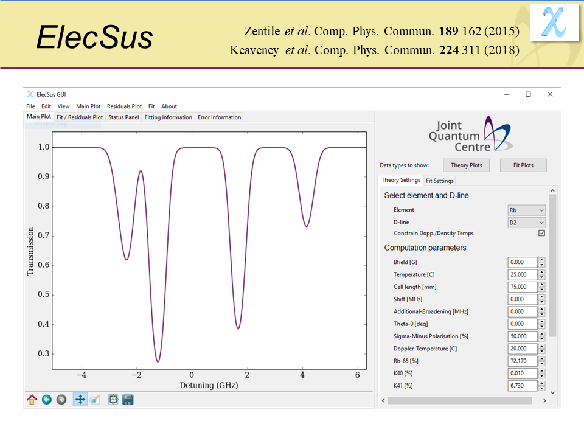

## Overview

ElecSus is an open-source code that uses the uncoupled basis and populates the Hamiltonian matrix with the hyperfine structure and Zeeman interaction. The ElecSus package was developed at Durham, and there are two papers explaining how the code works. We use ElecSus for two important roles: (i) it allows us to predict optimal experimental parameters for realising experiments, optical components etc. (ii)  the package allows the user to input experimental data, and to perform least-squares fits to extract parameters. The package finds great utility in Durham and worldwide for the spectroscopy of alkali-metal atoms.

## Apply Now!

If you are interested in joining the team or finding out more, please contact i.g.hughes@durham.ac.uk.

## Papers of interest

1.	Laser spectroscopy of hot atomic vapours: from ’scope to theoretical fit
D Pizzey, JD Briscoe, FD Logue, FS Ponciano-Ojeda, SA Wrathmall, I G Hughes 	*New Journal of Physics* **24** (12), 125001
[https://doi.org/10.1088/1367-2630/ac9cfe](https://doi.org/10.1088/1367-2630/ac9cfe)
2.	ElecSus: A program to calculate the electric susceptibility of an atomic ensemble
MA Zentile, J Keaveney, L Weller, DJ Whiting, CS Adams, IG Hughes
*Computer Physics Communications* **189**, 162-174
[https://doi.org/10.1016/j.cpc.2014.11.023](https://doi.org/10.1016/j.cpc.2014.11.023)
3.	ElecSus: Extension to arbitrary geometry magneto-optics
J Keaveney, CS Adams, IG Hughes
*Computer Physics Communications* **224**, 311-324
[https://doi.org/10.1016/j.cpc.2017.12.001](https://doi.org/10.1016/j.cpc.2017.12.001)

## PhD Theses

* [Mark Zentile]( http://etheses.dur.ac.uk/11212/)
* [Francisco Ponciano-Ojeda](http://etheses.dur.ac.uk/14065/)

## Team members

|**Name**|
|--------|
|[Prof. Ifan Hughes](https://www.durham.ac.uk/staff/i-g-hughes/)|
|[Dr. Steven Wrathmall](https://www.durham.ac.uk/staff/s-a-wrathmall/)|
