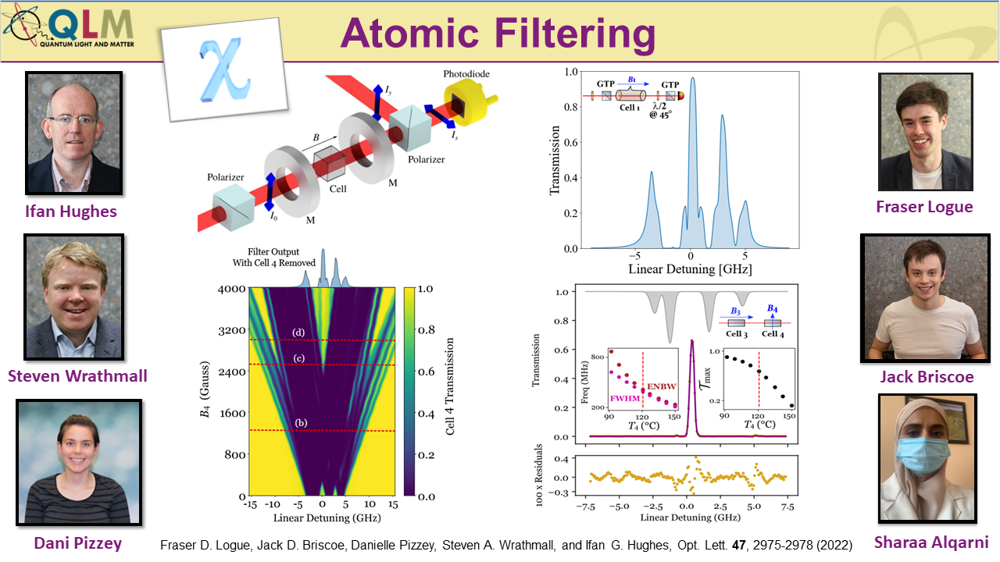

## Overview

We study the propagation of light through thermal vapours placed in an external magnetic field.

We have particular expertise and interest in designing, building and characterising ultra-narrow atomic filters. The filters developed in our laboratory have the best recorded figures of merit

## Apply Now!

If you are interested in joining the team or finding out more, please contact i.g.hughes@durham.ac.uk.

## Papers of interest

1.	Laser spectroscopy of hot atomic vapours: from ’scope to theoretical fit
D Pizzey, JD Briscoe, FD Logue, FS Ponciano-Ojeda, SA Wrathmall, I G Hughes 	*New Journal of Physics* **24** (12), 125001
[https://doi.org/10.1088/1367-2630/ac9cfe](https://doi.org/10.1088/1367-2630/ac9cfe)
2.	Voigt transmission windows in optically thick atomic vapours: a method to create single-peaked line centre filters
JD Briscoe, FD Logue, D Pizzey, SA Wrathmall, IG Hughes
*Journal of Physics B: Atomic, Molecular and Optical Physics* **56** (10), 105403
[https://doi.org/10.1088/1361-6455/acc49c](https://doi.org/10.1088/1361-6455/acc49c)
3.	Better magneto-optical filters with cascaded vapor cells
FD Logue, JD Briscoe, D Pizzey, SA Wrathmall, IG Hughes
*Optics Letters* **47** (12), 2975-2978
[https://doi.org/10.1364/OL.459291](https://doi.org/10.1364/OL.459291
)
4.	Absorption spectroscopy and Stokes polarimetry in a 87Rb vapour in the Voigt geometry with a 1.5 T external magnetic field
FS Ponciano-Ojeda, FD Logue, IG Hughes
*Journal of Physics B: Atomic, Molecular and Optical Physics* **54** (1), 015401
[https://doi.org/10.1088/1361-6455/abc7ff](https://doi.org/10.1088/1361-6455/abc7ff)
5.	Quantitative optical spectroscopy of 87Rb vapour in the Voigt geometry in DC magnetic fields up to 0.4 T
J Keaveney, FS Ponciano-Ojeda, SM Rieche, MJ Raine, DP Hampshire, Ifan G Hughes
*Journal of Physics B: Atomic, Molecular and Optical Physics* **52** (5), 055003
[https://doi.org/10.1088/1361-6455/ab0186](https://doi.org/10.1088/1361-6455/ab0186)

## PhD Theses

* [Clare Higgins](http://etheses.dur.ac.uk/14829/)
* [Francisco Ponciano-Ojeda](http://etheses.dur.ac.uk/14065/)
* [Renju Matthew](http://etheses.dur.ac.uk/13903/)

## Team members

|**Name**|
|--------|
|[Prof. Ifan Hughes](https://www.durham.ac.uk/staff/i-g-hughes/)|
|[Dr. Dani Pizzey](https://www.durham.ac.uk/staff/danielle-boddy/)|
|[Dr. Steven Wrathmall](https://www.durham.ac.uk/staff/s-a-wrathmall/)|
|[Jack Briscoe](https://www.durham.ac.uk/staff/jack-d-briscoe/)|
|[Sharaa Alqarni](https://www.durham.ac.uk/staff/sharaa-alqarni/)|
