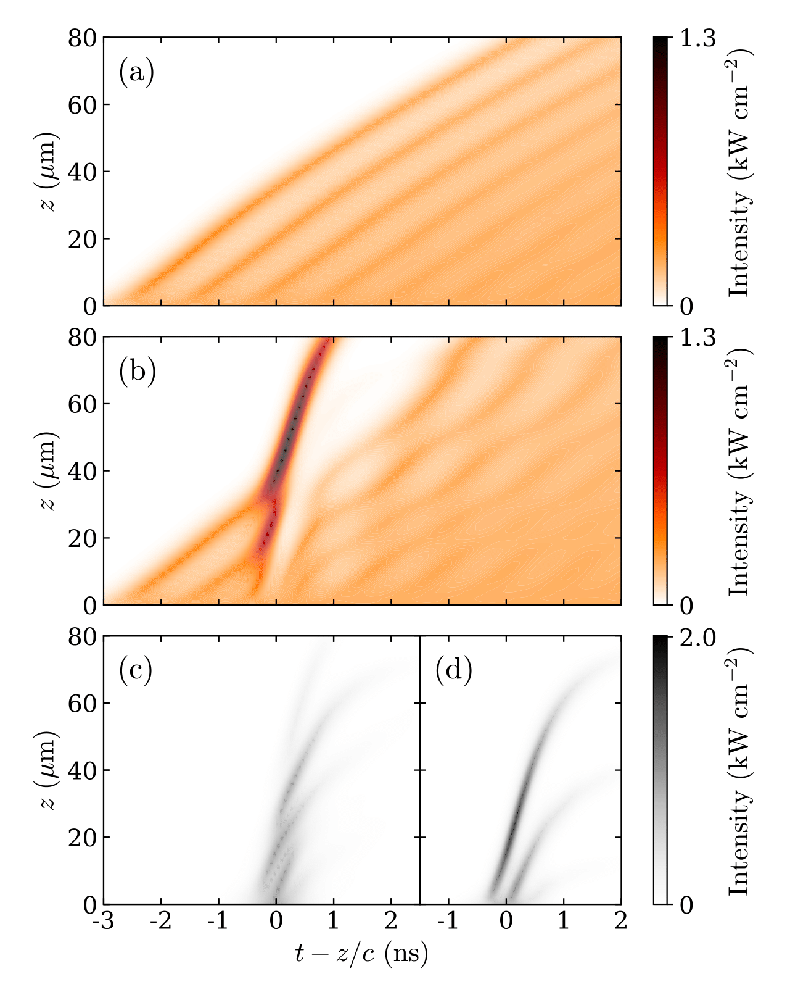

## Overview

  
*Non linear optical waves in a Rb vapour and formation of simultons under bichromatic excitation*

It has been long known that very intense light sources can create self-reinforcing pulses of light called solitons, which can propagate through an opaque medium as though it were nearly transparent. Two-colour solitons, called simultons, can also be created by combining a weak signal with an intense pulse of a different wavelength, but it is only recently that this fact has been demonstrated in an atomic vapour. Remarkably, these simultons form because of a complex non-linear interaction between the two fields mediated by the atoms. We are planning to study the theory of this effect in depth, and to explore the possibilities offered by simultons for developing new ways of controlling how light interacts with light.

## Papers of interest
1. Thomas P Ogden, K A Whittaker, J Keaveney, S A Wrathmall, C S Adams, and R M Potvliege, *Quasisimultons in thermal atomic vapors*,
[Physical Review Letters **123**, 243604 (2019).](https://doi.org/10.1103/PhysRevLett.123.243604)

## Team members

|**Name**|
|--------|
|[Dr. Robert Potvliege](https://www.durham.ac.uk/staff/r-m-potvliege/)|
|[Dr. Steven Wrathmall](https://www.durham.ac.uk/staff/s-a-wrathmall/)|
