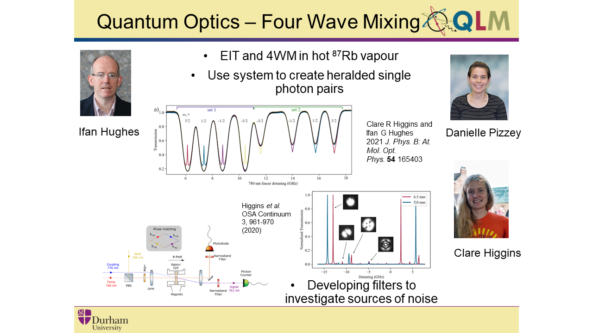

## Overview

We study quantum optics with Rb vapour in the hyperfine Paschen-Back regime. We use a diamond scheme to utilise the power of quantum entanglement, this allows us to create heralded single-photon pairs.

## Apply Now!

If you are interested in joining the team or finding out more, please contact i.g.hughes@durham.ac.uk.

## Papers of interest

1.	Laser spectroscopy of hot atomic vapours: from ’scope to theoretical fit
D Pizzey, JD Briscoe, FD Logue, FS Ponciano-Ojeda, SA Wrathmall, I G Hughes 	*New Journal of Physics* **24** (12), 125001
[https://doi.org/10.1088/1367-2630/ac9cfe](https://doi.org/10.1088/1367-2630/ac9cfe)
2.	Electromagnetically induced transparency in a V-system with 87Rb vapour in the hyperfine Paschen-Back regime
CR Higgins, IG Hughes
*Journal of Physics B: Atomic, Molecular and Optical Physics* **54** (16), 165403
[https://doi.org/10.1088/1361-6455/ac20be](https://doi.org/10.1088/1361-6455/ac20be)
3.	Atomic line versus lens cavity filters: a comparison of their merits
CR Higgins, D Pizzey, RS Mathew, IG Hughes
*OSA Continuum* **3** (4), 961-970
[https://doi.org/10.1364/OSAC.390604](https://doi.org/10.1364/OSAC.390604)
4.	Single-photon interference due to motion in an atomic collective excitation
DJ Whiting, N Šibalić, J Keaveney, CS Adams, IG Hughes
*Physical review letters* **118** (25), 253601
[https://journals.aps.org/prl/abstract/10.1103/PhysRevLett.118.253601](https://journals.aps.org/prl/abstract/10.1103/PhysRevLett.118.253601)

## PhD Theses

* [Clare Higgins](http://etheses.dur.ac.uk/14829/) 
* [Renju Matthew](http://etheses.dur.ac.uk/13903/)
* [Dan Whiting](http://etheses.dur.ac.uk/12328/)

## Team members

|**Name**|
|--------|
|[Prof. Ifan Hughes](https://www.durham.ac.uk/staff/i-g-hughes/)|
|[Dr. Dani Pizzey](https://www.durham.ac.uk/staff/danielle-boddy/)|
