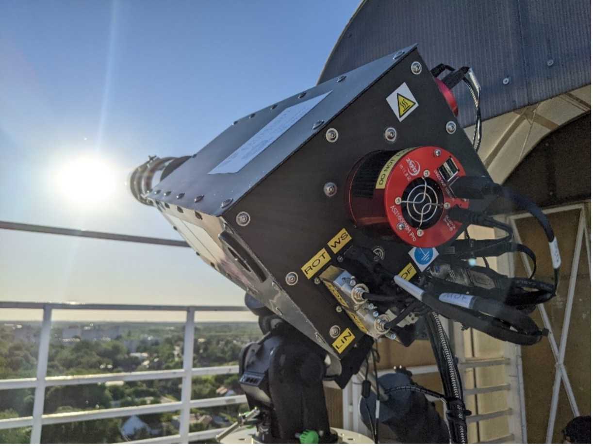

## Overview

The Sun continually emits a strong radiation accompanied wind of charged particles into the Solar System, giving rise to the phenomena known as space weather. Occasionally the Sun will flare and emit a more powerful radiation and wind in the direction of the Earth, creating a solar storm around the Earth. The most powerful solar storms have the potential to not only cause damage to satellites in orbit around the Earth, but also damage critical infrastructure on the ground such as the gas and power grids, navigation systems, and telecommunications. The largest solar storm ever recorded occurred in 1859 (the Carrington Event) and estimates of the damage that could be caused if such a storm were to hit the Earth today run to the trillions of dollars. With the increasing reliance of modern society on technologies that can be affected by extreme solar weather events, solar storms have been recognised as one of the key threats to modern society and appears in the UK’s list of largest risks to the country.

One of the main methods to protect key infrastructure is by forecasting when flares will occur. Early warning provides time to shutdown systems and protect satellites, but data from existing solar monitoring systems currently give only a few hours early warning of a potential event. Increasing this period by developing better forecasting models is one of the best ways to protect critical infrastructure. Knowledge of the magnetic field at the surface of the Sun is a key input into these forecast models and the more detailed the knowledge, the earlier the prediction can be made.

The Solar Activity Monitoring Network (SAMNET) aims to build a worldwide network of automatic observatories to provide 24-hour coverage of the solar magnetic field. In 2022, Durham and collaborators at Sheffield University designed, built, and installed a new prototype SAMNET instrument at the Gyula Bay Zoltán Solar Observatory in Hungary. This new prototype provides a measurement of the solar magnetic field across the full solar disk every few minutes and represents one of the first steps towards building a worldwide network of monitoring stations.

At the core of this instrument is a Magneto-Optical Filter (MOF), designed and built in Durham, that can isolate the light emitted from a narrow range of altitudes above the solar surface. The UK-based SAMNET teams at Durham and Sheffield have received further funding from STFC and the UK Space agency to upgrade this instrument to allow the wavelength of the MOF to be precisely varied. This changes the altitude about the solar surface at which the instruments measure the magnetic field. This will provide a full 3-dimensional model of the solar magnetic field which can be used to refine solar flare forecast models, providing up to 3 days advance warning of solar flares – a massive increase over the current predictions. Our next tasks are to develop the wavelength control and calibration systems to ensure that when the new instrument is being used, we fully understand instrument performance and that the system can reliably, and automatically provide the data we need it to.

## Papers of interest
1. Robertus  Erdélyi, Marianna B.  Korsós, Xin  Huang, Yong  Yang, Danielle  Pizzey, Steven A.  Wrathmall, Ifan G.  Hughes, Martin J.  Dyer, Vikram S.  Dhillon, Bernadett  Belucz, Roman  Brajša, Piyali  Chatterjee, Xuewu  Cheng, Yuanyong  Deng, Santiago Vargas  Domínguez, Raúl  Joya, Peter  Gömöry, Norbert G.  Gyenge, Arnold  Hanslmeier, Ales  Kucera, David  Kuridze, Faquan  Li, Zhong  Liu, Long  Xu, Mihalis  Mathioudakis, Sarah  Matthews, James R.T.  McAteer, Alexei A.  Pevtsov, Werner  Pötzi, Paolo  Romano, Jinhua  Shen, János  Temesváry, Andrey G.  Tlatov, Charles  Triana, Dominik  Utz, Astrid M.  Veronig, Yuming  Wang, Yihua  Yan, Teimuraz  Zaqarashvili, Francesca  Zuccarello
*J. Space Weather Space Clim.* **12** 2 (2022), [DOI: 10.1051/swsc/2021025](DOI: 10.1051/swsc/2021025)

## Team members

|**Name**|
|--------|
|[Prof. Ifan Hughes](https://www.durham.ac.uk/staff/i-g-hughes/)|
|[Dr. Dani Pizzey](https://www.durham.ac.uk/staff/danielle-boddy/)|
|[Dr. Steven Wrathmall](https://www.durham.ac.uk/staff/s-a-wrathmall/)|
